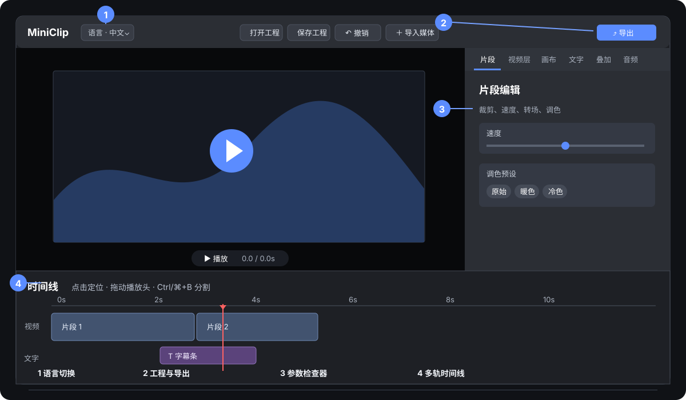
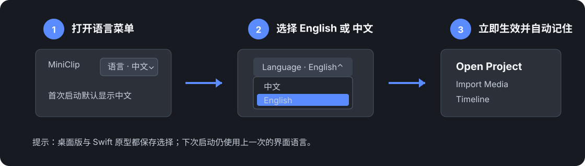

# MiniClip 桌面版 · 安装与使用说明

MiniClip 是一款运行于 **Windows / macOS / Linux** 的桌面视频编辑器。基本流程是：**导入视频 → 排序并逐段编辑 → 设置画布、文字、叠加素材和音乐 → 预览 → 导出 MP4**。

界面首次启动时默认显示**中文**，可随时切换到 English；选择会自动保存，下次启动继续生效。

> 重要：界面中的预览是为了操作流畅而做的近似显示，无法完整复现所有 FFmpeg 效果。**导出的 MP4 才是成片效果的权威结果。** 建议先用几秒素材试导出，再制作长视频。

---

## 目录

1. [系统要求](#系统要求)
2. [安装](#安装)
3. [界面语言：中文默认与中英文切换](#界面语言中文默认与中英文切换)
4. [可选资源准备](#可选资源准备)
5. [快速上手](#快速上手)
6. [逐片段编辑](#逐片段编辑)
7. [画布、文字与叠加素材](#画布文字与叠加素材)
8. [自动字幕](#自动字幕)
9. [音频、预览与导出](#音频预览与导出)
10. [快捷键](#快捷键)
11. [常见问题](#常见问题)

---

## 系统要求

| 项目 | 要求 |
|---|---|
| 操作系统 | Windows 10+ / macOS 11+ / 主流 Linux 桌面发行版 |
| 从源码运行 | Node.js 18+，建议 20 / 22 |
| FFmpeg | 无需单独安装，项目会准备对应平台的 FFmpeg / ffprobe |
| 自动字幕 | 可选 `smart-whisper` 原生依赖、本地 GGML 模型，以及足够的 CPU/内存 |

## 安装

### 方式 A：使用安装包

选择与系统相符的文件：

| 系统 | 安装包 |
|---|---|
| Windows | `MiniClip-Setup-*.exe`，或免安装 `*portable*.exe` |
| macOS | `MiniClip-*.dmg` |
| Linux | `MiniClip-*.AppImage` 或 `*.deb` |

macOS 若阻止首次启动，可右键应用 →「打开」；Windows SmartScreen 提示时可查看「更多信息」后确认运行。项目仓库若尚未提供 Release 安装包，请使用源码方式或 GitHub Actions 构建。

安装包包含日常剪辑与导出所需的 FFmpeg，但**不包含 Whisper 语音模型**。首次点击自动字幕时，应用会把默认 tiny 模型下载到可写的用户数据目录；之后识别无需联网。

### 方式 B：从源码运行

```bash
cd desktop
npm install
npm start
```

仓库已配置国内镜像。若 Electron 或 FFmpeg 二进制因网络中断未下载完整，可重试：

```bash
npm run fetch:binaries
```

自行构建当前平台安装包：

```bash
npm run dist
```

Windows、macOS、Linux 安装包通常需要在相应系统上分别构建；仓库的 GitHub Actions 可以并行构建三平台版本。

## 界面语言：中文默认与中英文切换

MiniClip 的桌面版与 Swift 原型均以**中文**作为首次启动的默认语言。需要英文界面时，不用重启应用：点击顶部左侧的「语言」下拉框，选择 `English` 即可；再次选择「中文」便会切回中文。



| 编号 | 区域 | 用途 |
|---:|---|---|
| 1 | 语言菜单 | 在「中文」和 `English` 间切换；首次启动为中文。 |
| 2 | 顶部工具栏 | 打开/保存工程、导入素材、撤销/重做、选择导出质量和导出成片。 |
| 3 | 右侧检查器 | 按「片段、视频层、画布、文字、叠加、音频」配置当前素材或整个工程。 |
| 4 | 底部时间线 | 调整片段顺序、播放头、标记、图层和独立音频的位置与时长。 |



语言切换会立即更新工具栏、面板、按钮、提示文字和后续打开的系统文件对话框。语言偏好仅保存在当前设备的应用设置中，**不会写入 `.miniclip` 工程文件**，因此同一工程在不同电脑上会按照各自的软件语言显示。

> Swift / iOS / macOS 原型的语言菜单也在顶部工具栏，行为相同：默认中文，选择会保存到系统用户偏好。

## 可选资源准备

以下命令都应在源码的 `desktop/` 目录执行，不是安装后 GUI 内的命令。

### 下载中文字体

文字和字幕由 libass 烧录到成片。没有项目字体时会回退到系统字体；为让中文显示更稳定，可在启动或打包前运行：

```bash
npm run fetch:font
```

它会把 Noto Sans SC 放入 `assets/fonts/`。重复运行会自动跳过已有字体；下载失败不影响普通安装和剪辑。

### 下载自动字幕模型

默认下载 `small`：

```bash
npm run fetch:whisper-model
```

也可以选用以下模型：

```bash
npm run fetch:whisper-model -- tiny
npm run fetch:whisper-model -- base
npm run fetch:whisper-model -- small
npm run fetch:whisper-model -- medium
```

| 模型 | 典型体积 | 适合场景 |
|---|---:|---|
| `tiny` | 约 75 MB | 最快、资源占用最低；准确率也最低 |
| `base` | 约 142 MB | 希望较快完成、可以接受较多人工校对 |
| `small` | 约 466 MB | 默认项；中文准确率、速度和资源占用较均衡 |
| `medium` | 约 1.5 GB | 更重视准确率；识别更慢且需要更多内存 |

源码方式下载的模型保存在 `assets/models/ggml-<名称>.bin`；安装版首次使用会保存到应用用户数据目录的 `models/`。这些模型体积较大，不随仓库或安装包提供。

---

## 快速上手

启动后，界面由顶部工具栏、左侧预览、右侧五个编辑页签和底部时间线组成。

1. 点右上角「＋ 导入视频」，可一次选择多个视频。
2. 在底部时间线点选要编辑的片段。
3. 在右侧「片段」中设置裁剪、速度、倒放、入场/出场动画、运动、调色和到下一段的转场。
4. 在「画布」中选择横屏、竖屏、方形或 4:3。
5. 需要时在「文字」「叠加」「音频」中加入字幕、贴纸/画中画和背景音乐。
6. 点「▶ 播放」检查大致时序，再点「⤴ 导出」生成 MP4。
7. 导出完成后点「在文件夹中显示」定位成片。

导入视频支持 `mp4`、`mov`、`m4v`、`mkv`、`avi`、`webm`。每个文件会成为一张时间线卡片；拖动卡片或使用卡片上的 ← / → 可排序，🗑 可删除。选中片段后可在右侧用起点/止点滑块裁剪保留区间。

选中主视频片段后，可在右侧顶部编辑「片段名称」。名称会显示在时间线卡片上，并随工程保存；适合为镜头、段落或素材版本加上更容易识别的标签。

顶部「插入」会把新导入的视频放到当前播放头：播放头在片段中间时，原片段会自动分成前后两段，新素材插入其中；后续文字、图层、独立音频和标记会按新素材时长波纹后移。倒放片段也会按屏幕上看到的播放顺序正确分割。

主视频片段也支持 `Ctrl/⌘+C` 和 `Ctrl/⌘+V`：复制后把播放头放到目标位置粘贴，副本会在播放头插入并自动命名为「· 副本」。若播放头位于其他片段中间，该片段会先按可见播放顺序分割；后续内容随副本时长波纹后移。

### 时间线标记与磁吸

把播放头放在需要卡点、待复查或准备切开的时间后，点时间线右上角的「◆ 标记」或按 `M`。标记以黄色菱形显示在标尺上；点击它可立即定位，`[` / `]` 可跳到前一个或后一个标记，选中后可用 `Delete` / `Backspace` 删除。选中标记后，可在时间线工具栏的「标记注释」输入框填写如“开场”“卡点”“待替换”等说明；注释显示在悬停提示中并随工程保存。

拖动文字、叠加、视频层或独立音频时，会对标记磁吸，方便把字幕、贴纸和音效对齐到节拍或剪辑笔记。标记不出现在导出画面中，但会保存到 `.miniclip` 工程；插入、覆盖、波纹删除、删除静音以及应用变速曲线时，其时间会随时间线同步调整。

时间线工具栏中的「🧲 磁吸」可一键关闭或开启对播放头、片段边缘、标记和节拍的自动对齐。需要自由微调位置或裁剪边缘时可暂时关闭；开关状态会随工程保存。

在「片段」面板点「♩ 检测节拍」后，当前片段的节拍会以橙色细刻度显示在时间标尺上。拖动字幕、贴纸、视频层或独立音频时会对这些刻度磁吸；节拍只作为当前编辑会话中的对齐辅助，不会出现在导出画面。

主视频卡片悬停或选中时，左右边缘会显示白色裁剪柄。拖动左柄改变片段的可见起点，拖动右柄改变可见终点；也可使用右侧「片段」面板的起点 / 止点滑块。两种方式都以成片时间为准，变速和倒放片段也会正确映射到原素材。提交后，后续字幕、图层、独立音频和标记会随新的片段长度同步移动，且整次调整可以一次撤销。

命中播放头、节拍、标记或其他素材边缘时，会出现青色竖向引导线，确认当前已经吸附。选中主视频片段后按 `Delete` / `Backspace` 会执行波纹删除；选中字幕、叠加、视频层或独立音频时，同一快捷键只删除当前素材。

时间线右上角的 `−` / `＋` 可调整刻度。也可把鼠标放在需要查看的位置，按住 `Ctrl`（macOS 为 `⌘`）滚动滚轮缩放；当前位置会保持在鼠标下方，适合快速放大某个剪辑点后进行裁剪或卡点。

时间线工具栏中的时间码输入框可直接定位播放头：输入秒数（如 `12.5`）或时间码（如 `1:02.5`、`1:01:02.5`）后按 `Enter`，播放头会跳到对应位置；输入框会随播放头自动更新。

长工程需要回到全局编排时，点时间线右上角「适配」或按 `Shift+Z`，会把整条成片缩放到当前可视区域；`Home` / `End` 则直接跳到时间线开头 / 结尾。

播放时，红色播放头接近当前可视区域边缘会自动带动时间线横向跟随，方便持续检查长素材；拖动播放头、裁剪或编辑轨道时不会自动抢占当前视图。

## 逐片段编辑

先点选时间线卡片，再打开右侧「片段」。这里的设置只作用于当前片段。

### 速度与倒放

- 速度范围为 **0.25×–4×**，步长 0.05；也可直接点 0.5×、1×、2×、4×。
- 变速同时作用于画面和该片段原声，并会改变片段在总时间线上的长度。
- 开启「倒放」后，导出会同时反转画面和原声。

预览可近似播放变速，但不会实际预览倒放；倒放结果请以导出文件为准。

### Ken Burns 推拉

「运动」可选：

- 无；
- 放大：从 1× 居中推近至约 1.25×；
- 缩小：从约 1.25× 居中拉远至 1×。

当前版本不能调整推拉方向、强度或缓动，而且预览不会显示 Ken Burns；导出时才由 FFmpeg 完整渲染。

### 片段入场与出场动画

选中时间线片段后，在「片段 > 片段动画」中可分别配置入场和出场。当前提供以下高频动画：

| 类型 | 可选效果 |
|---|---|
| 入场 | 无、淡入、左滑入、右滑入、上滑入、下滑入 |
| 出场 | 无、淡出、左滑出、右滑出、上滑出、下滑出 |

每个动画可设置 **0–2 秒** 时长，且只改变画面，不改变片段在时间线上的长度或原声长度。为了防止短片段的入场和出场相互覆盖，导出会自动把每个动画限制为该片段有效时长的一半以内。

动画与「与下一段的转场」可以同时使用：动画作用于单个片段的首尾画面，转场作用于两个相邻片段的边界。分割片段时，原入场动画保留在左半段、原出场动画与转场保留在右半段，避免在新切口意外重复动画。普通编辑预览以播放响应为先；请使用「成片预览」或导出短片确认最终动画。

### 变速曲线预设

除了直接设置固定速度，还可在「片段 > 变速曲线预设」中选择以下节奏预设：

| 预设 | 可见播放速度顺序 | 适用场景 |
|---|---|---|
| 加速强调 | 1× → 2× → 1× | 省略过程、突出动作瞬间 |
| 慢动作强调 | 1× → 0.5× → 1× | 强调表情、落点或转折 |
| 快慢快 | 2× → 0.5× → 2× | 节奏化展示或卡点效果 |

点击「应用曲线」后，MiniClip 会把当前片段按源素材平均拆成连续的 3 段，并把预设速度写到各段。它们是普通时间线片段，因此仍可单独裁剪、调整速度、调色、添加动画、撤销或删除；工程不依赖隐藏的曲线数据。原片段的入场动画只留在第一段，出场动画和到下一段的转场只留在最后一段。

若文字、贴纸、视频层或独立音频位于原片段的时间范围内，应用时会按新的时长重新定位；带逐字时间的自动字幕也会同步重映射。主视频原声始终随三段速度一起变速。独立音频会调整时间位置但不会自动进行复杂的音色拉伸，需对声音严格卡点时建议先试听成片预览。

### 主片段不透明度

在「片段 > 画面变换」中可设置 **0–100%** 不透明度。降低数值时，画面会露出「画布」面板中设置的背景色；这可用于制作淡化背景、叠加多个视频层，或为文字与贴纸留出更清晰的对比。

不透明度只影响当前主视频片段的画面，**不会降低原声音量**，也不会改变片段时长。成片预览和正式导出都会以同一背景色合成；如使用模糊背景填充，主片段的透明度作用在已经生成的完整画面上。

### 静音片段原声

选中带原声的视频片段后，点击「🔊 静音片段」即可关闭该片段的原始声音；按钮会变为「🔇 解除静音」，再次点击可恢复之前的音量、淡入淡出和变速音频设置。静音不会删除素材，也不会影响背景音乐、独立音频轨或已经“分离音频”生成的音频片段。时间线片段上会显示“静音”标识，且状态会保存到工程中。

### 可配置定格帧

在片段面板顶部的「定格」输入框设置 **0.1–30 秒**，再点「▣ 插入定格帧」，MiniClip 会从当前播放头提取一帧并生成无声的本地 MP4 插入时间线。默认值为 2 秒，适合强调镜头、停顿说明和卡点。

若播放头位于片段中间，原片段会自动分成前后两段，定格画面插在中间；后续文字、叠加、视频层和独立音频会按照实际设置的时长自动波纹后移。定格帧继承原片段的填充、调色、镜像、旋转、裁剪和画面变换，但不会继承原声或运动动画。生成的定格素材可继续裁剪、设置时长、导出并随“打包工程”一并收集。

### 复制当前主视频片段

选中主视频片段后，点击「⧉ 复制并插入」或使用 Ctrl/⌘ + D，可在当前片段之后插入一个完整副本。副本继承裁剪、速度、原声设置、调色、特效、画面变换、动画和主片段变换关键帧；后续文字、叠加、视频层与独立音频会按副本的实际时长波纹后移。

原片段原有的“与下一段的转场”会移动到副本与后续片段之间，因此原片段和副本之间默认是硬切，不会意外重复转场。该操作可撤销。

### 复制与粘贴画面属性

需要让多个镜头保持相同的构图、调色或动画时，先选中作为样板的片段，点击「◫ 复制画面属性」，再选择目标片段并点击「▣ 粘贴画面属性」。也可用：

- Windows / Linux：`Ctrl` + `Shift` + `C` / `Ctrl` + `Shift` + `V`
- macOS：`⌘` + `Shift` + `C` / `⌘` + `Shift` + `V`

会复制：填充方式、裁剪、镜像、旋转、不透明度、缩放/平移、调色与 LUT、片段特效、Ken Burns 运动、防抖，以及入场/出场动画。不会复制：媒体文件、片段裁剪起止、速度/变速曲线、原声音量和淡化、时间线位置、字幕、图层或与下一段的转场。粘贴操作可用撤销恢复。

### 主片段变换关键帧

主视频也可在「片段 > 画面变换」中记录关键帧。先在某个时刻设置缩放、横移、纵移和不透明度，然后输入该片段内的时间并点「＋ 记录当前变换」；在另一时刻设置新的数值并再次记录，即可形成动画。关键帧时间从当前片段在成片中的起点开始计时，而不是工程总时间。

每个记录点可选择线性、缓入、缓出或缓入缓出曲线。关键帧会随工程保存，普通预览、成片预览和导出均使用同一套插值。应用变速曲线时，已有变换关键帧会按新的分段时长重新分配；分割片段时，建议在成片预览中检查分割点附近的连续性。

### 暗角与颗粒

「片段特效」面板除黑白电影、复古胶片、柔光和锐化预设外，还提供可叠加的 **暗角** 与 **颗粒** 滑块（0–100%）：

- 暗角：压暗画面四周，帮助将视觉注意力集中到中心主体；
- 颗粒：加入动态胶片颗粒，让画面更有质感；
- 两者可与调色、LUT、复古胶片等任意片段特效叠加，也可通过“复制画面属性”批量套用。

普通编辑预览为性能优先的近似效果；颗粒的随机纹理与最终暗角范围请以「成片预览」或导出的 MP4 为准。

### 调色

可以使用五个预设，也可继续拖动参数微调：

| 预设 | 亮度 | 对比度 | 饱和度 | 色温 |
|---|---:|---:|---:|---:|
| 原始 | 0 | 1.00 | 1.00 | 0 |
| 暖色 | 0.03 | 1.05 | 1.15 | -40 |
| 冷色 | 0 | 1.05 | 1.05 | 45 |
| 鲜艳 | 0.04 | 1.20 | 1.50 | 0 |
| 黑白 | 0 | 1.10 | 0 | 0 |

手动范围为：亮度 -0.5–0.5、对比度 0.5–2、饱和度 0–3、色温 -100–100。预览使用 CSS 滤镜近似调色，FFmpeg 导出的色彩可能略有不同。

### 填充方式

片段可以「跟随画布」，也可以覆盖为：

- 黑边：完整保留原画比例，多出的区域补黑；
- 模糊背景：用铺满画布的模糊副本作背景，再将完整清晰画面居中。

### 逐边界转场

每个非末尾片段都有「与下一段的转场」。设置作用于当前片段与下一片段之间，因此每个边界可以使用不同效果。界面一共提供 20 个切换选项：

| 类别 | 选项 |
|---|---|
| 无效果 | 硬切 |
| 基础 | 淡入淡出、黑场、白场、溶解 |
| 擦除 | 左擦除、右擦除、上擦除、下擦除 |
| 滑动 | 左滑、右滑、上滑、下滑 |
| 平滑 | 平滑左、平滑右 |
| 图形/风格 | 圆形展开、圆形闭合、径向、像素化、对角 |

时长范围是 0–2 秒、步长 0.1 秒。选择一种效果时，若原时长为 0，会自动设为 0.5 秒；导出时还会把它限制在相邻片段有效时长中较短者的一半以内。画面和原声会同步交叉过渡。

转场不在预览中真实合成，必须以导出结果为准。如果状态栏提示 FFmpeg 缺少 `xfade`，请先修复 FFmpeg，或把所有边界改为硬切。

## 画布、文字与叠加素材

### 输出画布

在右侧「画布」选择成片比例和默认填充方式：

| 画幅 | 输出分辨率 | 典型用途 |
|---|---:|---|
| 16:9 | 1280×720 | 横屏视频 |
| 9:16 | 720×1280 | 手机竖屏 / 短视频 |
| 1:1 | 720×720 | 方形内容 |
| 4:3 | 960×720 | 传统画幅 |

全部以 30 fps 导出。默认填充方式为黑边，也可以切换为模糊背景；片段页的独立设置优先于画布默认值。预览区会切换外框比例，但不会真实显示模糊背景。

### 手动文字 / 字幕

打开「文字」，点「＋ 添加文字」。每条文字可设置：

- 内容和在总时间线上的开始/结束时间；
- 底部、顶部、居中、左下、右下、左上、右上；
- 12–200 的字号；
- 文字颜色与描边颜色；
- 0–2 秒的淡入淡出。

导出时 MiniClip 会生成临时 ASS 字幕文件，并通过 FFmpeg 的 `subtitles` 滤镜和 libass 将文字烧录到画面。预览用 HTML 文字层近似展示，不会准确复现字体、描边和淡入淡出。若需要稳定的中文字体，请先运行 `npm run fetch:font`。

### 图片 / 视频画中画和贴纸

打开「叠加」，点「＋ 添加图片/视频」。支持：

- 图片：PNG、JPG/JPEG、GIF、WebP、BMP；
- 视频：MP4、MOV、M4V、MKV、WebM。

每个叠加素材可设置：

- 开始/结束时间；
- 大小 5%–100%（以画布宽度为基准，高度保持素材比例）；
- X/Y 像素位置；
- 0%–100% 不透明度；
- 0–2 秒的对称淡入淡出；
- 勾选「线性移动到」后，从当前 X/Y 匀速移动到目标 X/Y。

图片会保持到设定结束时间；叠加视频如果较短，会静音循环到设定结束时间。素材淡入淡出在预览中不会精确显示，所以最终效果仍以导出为准。

## 自动字幕

自动字幕基于本地 `smart-whisper` / whisper.cpp，不需要云端接口。使用前必须同时满足：

1. 已安装可选依赖 `smart-whisper`；
2. 一个 `ggml-*.bin` 模型；首次使用可自动下载 tiny，也可提前手动准备。

若缺少依赖，在源码的 `desktop/` 目录运行：

```bash
npm install smart-whisper
npm run rebuild:native
```

该原生模块需要编译工具：Windows 是 Visual Studio Build Tools（C++），macOS 是 Xcode Command Line Tools，Linux 是 Python 3、make、g++。如果安装失败，普通剪辑和导出仍可使用，只是自动字幕不可用。

若缺模型，运行：

```bash
npm run fetch:whisper-model
```

使用步骤：

1. 在时间线点选需要识别的片段；未选择时会使用第一段。
2. 打开「文字」，点「🎤 自动字幕」。
3. 等待 CPU 完成本地识别。片段越长、模型越大，等待越久。
4. 识别结果会加入文字列表，默认是底部、48 号白字黑描边。
5. 逐条校对内容、开始/结束时间和样式，再导出检查。

当前自动字幕有两项使用边界：

- 只识别当前选中的单个源视频，不会一次扫描整条时间线；多段素材需分别执行。
- 应用只识别片段保留的裁剪区间，并自动把时间映射到变速/倒放后的成片时间线；机器识别仍可能有错字，需要人工校对。

如果同时存在多个模型，应用默认优先级为 `medium → small → base → tiny`。模型越大通常越准确，但 CPU 推理更慢、内存占用更高。

## 音频、预览与导出

### 背景音乐

在「音频」页添加 `mp3`、`m4a`、`aac`、`wav`、`flac` 或 `ogg`：

- 背景音乐会自动循环到整条时间线结束；
- 原声和音乐音量可在 0%–100% 间分别调整；
- 点「移除」可删除音乐。

背景音乐及最终混音不在预览中播放，只在导出时合成。

### 预览能看什么

预览可以帮助检查：

- 片段顺序与大致时间；
- 变速；
- 近似调色；
- 文字和叠加素材的大致位置；
- 叠加素材的线性移动。

以下效果不显示或与成片不完全一致：倒放、Ken Burns、转场、模糊背景、精确调色、libass 字体/描边/淡入淡出、叠加素材淡入淡出与视频结束行为、背景音乐和最终混音。

再次强调：**预览是近似，导出才是权威。**

### 导出规格

| 项目 | 值 |
|---|---|
| 容器 | MP4，启用 `+faststart` |
| 视频 | H.264 / libx264，yuv420p，CRF 20，preset medium |
| 分辨率 | 由所选画幅决定 |
| 帧率 | 30 fps |
| 音频 | AAC，192 kbps，44.1 kHz 立体声 |

点顶部「⤴ 导出」后选择保存路径。状态栏会显示进度，可点「取消」终止；成功后可「在文件夹中显示」。所有效果都需要重新编码，长视频、多层素材和大分辨率会增加耗时。

## 快捷键

编辑历史最多保留最近 60 个状态。

| 操作 | Windows / Linux | macOS |
|---|---|---|
| 播放 / 暂停 | `空格` | `空格` |
| 添加时间线标记 | `M` | `M` |
| 跳到前 / 后一个标记 | `[` / `]` | `[` / `]` |
| 适配整条时间线 | `Shift` + `Z` | `Shift` + `Z` |
| 跳到时间线开头 / 结尾 | `Home` / `End` | `Home` / `End` |
| 跳到前 / 后一个主轨剪辑点 | `PageUp` / `PageDown` | `PageUp` / `PageDown` |
| 将主视频入点 / 出点设到播放头 | `I` / `O` | `I` / `O` |
| 播放头逐帧 / 逐秒移动（未选中副轨素材） | `←` / `→`；`Shift` + `←` / `→` | `←` / `→`；`Shift` + `←` / `→` |
| 主视频片段左 / 右移动 | `Alt` + `←` / `→` | `⌥` + `←` / `→` |
| 删除选中主视频（波纹） | `Delete` / `Backspace` | `Delete` / `Backspace` |
| 撤销 | `Ctrl` + `Z` | `⌘` + `Z` |
| 重做 | `Ctrl` + `Y` 或 `Ctrl` + `Shift` + `Z` | `⌘` + `Shift` + `Z` |

## 常见问题

- **`npm install` 下载慢或中断**  
  默认已配置国内镜像。联网后运行 `npm run fetch:binaries` 重试，也可配置代理或切换 npm 源。

- **启动提示找不到 FFmpeg**  
  重新执行 `npm install` 或 `npm run fetch:binaries`。源码开发环境也可以用 PATH 中的系统 FFmpeg 兜底。

- **提示缺少 xfade**  
  当前版本不会在导出时自动把已经选择的转场降级成硬切。请让项目自带 FFmpeg 生效，或升级系统 FFmpeg；修复前把各片段的转场改为「硬切」。

- **自动字幕提示未安装 smart-whisper**  
  它是可选原生依赖，可能因平台或构建环境被 npm 跳过。在 `desktop/` 运行 `npm install smart-whisper && npm run rebuild:native`；若仍无法安装，请检查该模块对当前系统/CPU/Node 版本的支持。普通剪辑不依赖它。

- **自动字幕首次使用等待较久**  
  应用会先下载默认 tiny 模型（约 75MB）；源码方式也可运行 `npm run fetch:whisper-model`，或手动把兼容模型放入 `desktop/assets/models/`。

- **中文字幕缺字或不同电脑字形不一致**  
  在源码目录运行 `npm run fetch:font`，重启应用后重新导出。

- **预览看不到转场、倒放、推拉、模糊背景或背景音乐**  
  属于当前近似预览的边界。导出一个短 MP4 检查实际效果。

- **叠加视频比显示区间短**  
  预览与导出都会静音循环素材，直到设定的结束时间。

- **导出较慢**  
  变速、倒放、调色、转场、推拉、字幕和叠加都需要 FFmpeg 重新编码，属于正常情况。

需要代码结构、打包和滤镜管线说明，请参阅 [`README.md`](README.md)。
